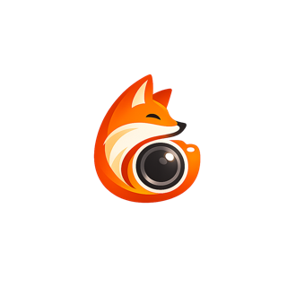
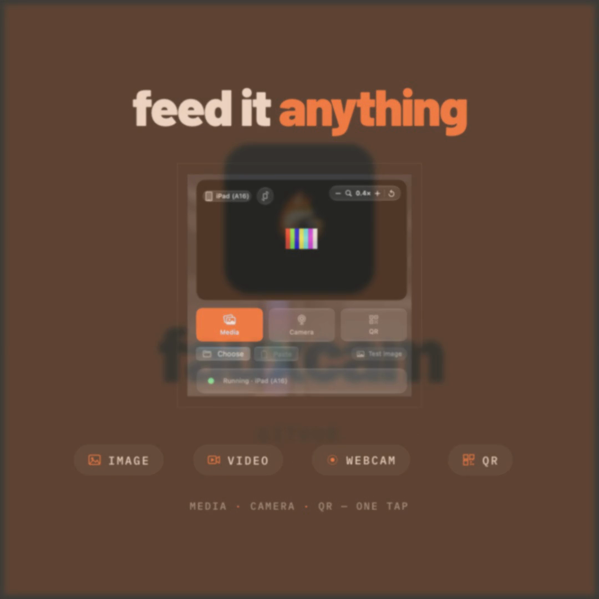
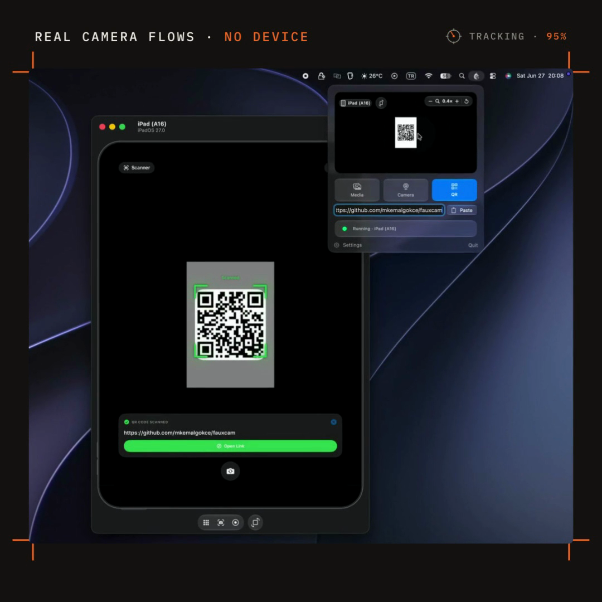

<p align="center">
  
</p>

<h1 align="center">FauxCam</h1>

<p align="center">
  <a href="https://mkemalgokce.github.io/fauxcam"></a>
  <a href="https://github.com/mkemalgokce/fauxcam/releases"></a>
  <a href="https://github.com/mkemalgokce/fauxcam/actions/workflows/ci.yml"></a>
  <a href="LICENSE"></a>
</p>

<p align="center">
  <a href="https://mkemalgokce.github.io/fauxcam"></a>
</p>

<p align="center">
  <strong><a href="https://mkemalgokce.github.io/fauxcam">mkemalgokce.github.io/fauxcam</a></strong>
</p>

Feed a custom camera source — a still image, a video file, your Mac's webcam/Continuity Camera, or a QR code — into apps running in the **iOS Simulator**, where Apple provides no camera.

## What it is

The iOS Simulator has no camera. Any app that opens `AVCaptureSession` gets nothing, so camera flows — scanning a QR code, capturing a photo, showing a live preview — can't be exercised without a physical device.

FauxCam fills that gap. It is a macOS menu-bar app (**FauxCamApp**) and a companion command-line tool (**`faux`**) that inject a small Objective-C dynamic library (`libFaux.dylib`) into a simulated app at launch, swizzle AVFoundation so the app discovers a fake front/back camera, and stream BGRA frames into it from the host. Nothing is installed inside the app or the device; when you stop, nothing is left behind.

<div align="center">
<table>
  <tr>
    <td align="center"><br><sub>Menu-bar viewfinder — WYSIWYG</sub></td>
    <td align="center"><br><sub>A QR source mirrored into a Simulator</sub></td>
  </tr>
</table>
</div>

## Requirements

- **macOS 26** or later
- **Xcode 26** or later (provides the Swift 6.3 toolchain and the iOS Simulator SDK)

The menu-bar app targets macOS 26 SwiftUI; the `faux` CLI and the core libraries build with the same toolchain.

## Install

FauxCam ships as **two independent downloads** on the [Releases](https://github.com/mkemalgokce/fauxcam/releases) page: the menu-bar app and the `faux` CLI are versioned and released separately, so you can take either one on its own.

### FauxCam.app (menu-bar app)

Released from `v*` tags as a Developer-ID-signed, notarized **`FauxCam.dmg`**.

1. Download `FauxCam.dmg` from the latest [`v*` release](https://github.com/mkemalgokce/fauxcam/releases).
2. Open the DMG and drag **FauxCam.app** to `/Applications`.
3. Launch it.

> **FauxCam is a menu-bar app.** It runs as a background agent (`LSUIElement`): its icon appears in the menu bar with **no Dock icon and no main window**. Click the menu-bar icon to open the viewfinder panel.

Because the DMG is notarized and stapled, it opens with a normal double-click — no Gatekeeper workaround needed.

### faux (CLI)

Released separately from `cli-v*` tags. Download the `faux` binary from the latest [`cli-v*` release](https://github.com/mkemalgokce/fauxcam/releases) and install it on your `PATH`:

```sh
install -m 0755 faux /usr/local/bin/faux

# First run only: clear the quarantine attribute macOS adds to downloads.
xattr -d com.apple.quarantine /usr/local/bin/faux 2>/dev/null || true

faux list
```

If macOS still reports the binary as quarantined, re-run the `xattr -d com.apple.quarantine` line above against `/usr/local/bin/faux`.

## Usage

### Menu-bar app

Launch **FauxCamApp** and click its menu-bar icon. It injects every booted simulator automatically — including apps you run from Xcode — so a target app sees the fake camera the moment it opens an `AVCaptureSession`.

The panel is a **viewfinder card** that shows the exact frame each simulator receives (WYSIWYG):

- **Pick a source** with the tab bar: **Media** (a still image or a video file), **Camera** (your Mac's webcam / Continuity Camera, mirrored), or **QR** (encode any text or URL).
- **Frame what the simulator sees** directly on the viewfinder: **drag** to pan, **scroll or pinch** to zoom, **two-finger twist** to rotate (it magnetically snaps to right angles). A one-time gesture hint explains the controls.
- **Top-left** is a liquid-glass picker for which booted simulator the viewfinder mirrors, plus a **portrait ⇄ landscape** orientation toggle. Changing orientation re-renders the preview and re-advertises that device's frame size, so the source rotates to fit the device.
- **Top-right** is a zoom badge (`−` / value / `+`) with a reset control.

The webcam source needs Mac camera access; the viewfinder requests it in-app and only streams once granted (the packaged app ships `NSCameraUsageDescription` and the camera entitlement).

### `faux` CLI

```
usage: faux <command>
  doctor [path-to-dylib]
  list
  apps [--device <udid>]
  serve [socket-path] [--source <source>]
  run [--device <udid>] [--source <source>] <bundle-id>

<source>: image | image:<path> | video:<path> | webcam | qr:<text>
```

| Command | What it does |
|---------|--------------|
| `doctor [path]` | Audits the guest dylib for loadability (platform, signing, architectures). Defaults to the bundled dylib; pass a path to audit another. |
| `list` | Lists booted simulators (`udid  name  runtime`). |
| `apps [--device <udid>]` | Lists a simulator's installed user apps (`bundle-id  name`) so you can find a bundle id for `run`. |
| `serve [socket-path] [--source ...]` | Runs only the frame server on an `AF_UNIX` socket; you launch the app yourself. |
| `run [--device <udid>] [--source ...] <bundle-id>` | Serves frames and launches the app with the guest injected, in one command. Press Ctrl-C to stop — the app is terminated and the dylib unloaded. |

`--source` values:

| Source | Meaning |
|--------|---------|
| `image` | The built-in solid-color test source (default) |
| `image:<path>` | A still image file |
| `video:<path>` | A video file, looped |
| `webcam` | The Mac's default camera / Continuity Camera |
| `qr:<text>` | A scannable QR code of `<text>` |

Examples:

```sh
faux doctor                  # is the guest dylib loadable?
faux list                    # which simulators are booted?
faux apps                    # installed apps on the booted simulator
faux apps --device <udid>    # ...on a specific simulator

faux run com.example.MyApp --source image:/path/to/photo.png
faux run com.example.MyApp --source video:/path/to/clip.mov
faux run com.example.MyApp --source webcam
faux run com.example.MyApp --source qr:https://example.com
faux run --device <udid> com.example.MyApp --source image
```

## How it works

FauxCam injects `libFaux.dylib` into the simulated process via `DYLD_INSERT_LIBRARIES`, the dylib swizzles AVFoundation to vend a fake front/back capture device, and the host streams BGRA frames to it over an `AF_UNIX` socket under `/private/tmp/com.fauxcam/`. The wire protocol has a single source of truth — the shared C header `Shared/faux_wire.h`, compiled by both host and guest. All "Apple-fighting" risk is isolated in the swizzles, which fall through to the original implementation on any failure so the host app never crashes.

For the layered, framework-independent design (domain → application → adapters → delivery) and the module map, see [docs/ARCHITECTURE.md](docs/ARCHITECTURE.md).

## Build from source

```sh
git clone https://github.com/mkemalgokce/fauxcam.git
cd fauxcam
swift build        # builds the faux CLI and the FauxCamApp menu-bar app
swift test         # runs the test suite
```

### Build the menu-bar app

`Scripts/sign-app.sh [identity]` builds the app icon, the guest dylib, and the release `FauxCamApp`, assembles `dist/FauxCam.app`, and code-signs it:

```sh
./Scripts/sign-app.sh        # ad-hoc, local use only
open dist/FauxCam.app
```

Pass a `"Developer ID Application: Your Name (TEAMID)"` identity to sign with the hardened runtime and build `dist/FauxCam.dmg`. With `NOTARIZE_PROFILE` also set, the script submits the DMG to Apple for notarization and staples the app and DMG so first launch works offline:

```sh
NOTARIZE_PROFILE=fauxcam-notary ./Scripts/sign-app.sh \
  "Developer ID Application: Your Name (TEAMID)"
```

The script prints the exact `notarytool store-credentials` step for creating the notarization profile.

### Build the CLI

`Scripts/package-cli.sh` builds and signs the standalone `faux` CLI for distribution (the `cli-v*` release artifact). To build only the guest dylib for either path, run `./Scripts/build-dylib.sh` (fat arm64+x86_64, iphonesimulator, ad-hoc signed).

## Distribution & signing

Releases are produced by two workflows: `.github/workflows/release.yml` (the menu-bar app, on `v*` tags) and `.github/workflows/release-cli.yml` (the standalone `faux` CLI, on `cli-v*` tags).

- A pushed **`v*`** tag builds, signs, notarizes, and publishes the menu-bar app as `FauxCam.dmg` via `release.yml`.
- A pushed **`cli-v*`** tag builds, signs, and publishes the standalone `faux` CLI via `release-cli.yml`.

Signing is driven entirely by repository secrets (`MACOS_CERTIFICATE_P12_BASE64`, `MACOS_CERTIFICATE_PASSWORD`, `MACOS_SIGNING_IDENTITY`, `APPLE_ID`, `APPLE_TEAM_ID`, `APPLE_APP_PASSWORD`) — no identity or password is ever hardcoded. There is no Developer ID Installer certificate, so FauxCam is distributed as a notarized DMG and a signed CLI binary rather than a `.pkg`.

## Tests

```sh
swift test
```

Unit tests run framework-free with fakes; simulator integration tests inject the guest into a booted simulator and assert frames reach the capture delegate (skipped automatically when no simulator is booted). CI runs the build and test suite on `macos-26`.

## Contributing, security, and license

- Contributions are welcome — see [CONTRIBUTING.md](CONTRIBUTING.md) and the [Code of Conduct](CODE_OF_CONDUCT.md).
- For security issues, follow [SECURITY.md](SECURITY.md); please don't open a public issue.
- FauxCam is a **local developer tool** for the iOS Simulator only — it does not touch physical devices and ships nothing into your own apps.

[MIT](LICENSE) © Mustafa Kemal Gökçe
